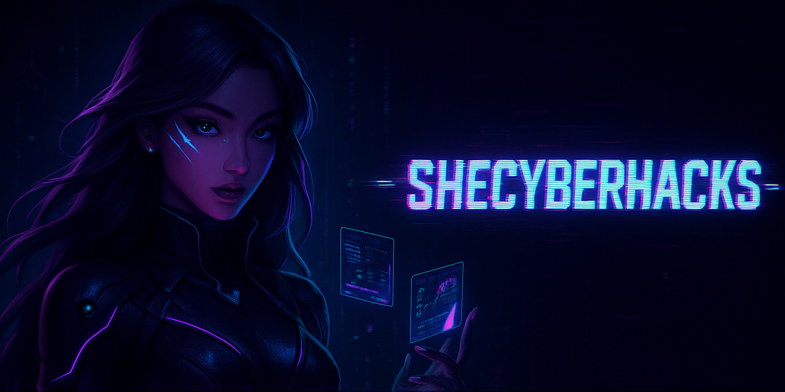

<!-- ============================== -->
<!-- 🔥 CYBERPUNK SHECYBERHACKS BANNER (optional placeholder) -->
<!-- ============================== -->

  

<h1 align="center">💜⚡ Portia “CyberBombshell” Jefferson ⚡💜</h1>
<h3 align="center">AI Security | Cybersecurity | FinTech | Regulated Industries Specialist</h3>

Founder of <strong>SheCyberHacks™</strong> • VP of WiCyS Atlanta Affiliate •  
Co-Founder and Former President of the WGU WiCyS Chapter  

<i>Feminine. Deadly. Brilliant. Cyberpunk.  
A tech prodigy with assassin-level precision and anime hacker queen intensity.</i>

---

## 🧬 Who I Am — *The AI Hacker Empress Behind SheCyberHacks™*

I specialize in **AI Security, Cybersecurity, FinTech Systems, and Compliance across regulated industries** including:

- **Finance**
- **Healthcare**
- **Government**
- **Insurance**
- **AI Governance & Safety**

I design systems that blend:

⚡ AI automation • ⚡ Cybersecurity engineering • ⚡ FinTech risk modeling • ⚡ Data governance • ⚡ Enterprise compliance  

—all through a uniquely feminine, cyberpunk, and deeply analytical lens.

---

## 📘 Certifications

<table align="center">
<tr>
<td>

### 🛡️ Cybersecurity & IT  
- ISC2 — Certified in Cybersecurity (CC)  
- Google Cybersecurity Professional  
- Google IT Support Specialist  
- Microsoft SC-900  
- CourseCareers — Information Technology  
- ISACA — Certified in Emerging Technology (CET)  

</td>
<td>

### 🤖 AI, Automation & Innovation  
- AI Cash Skool — Certified AI Specialist  
- Multi-Agent Systems Engineering (Projects)  
- Azure AI Services & Automation Experience  
- Conversational AI Systems (Independent)  

</td>
<td>

### 💼 FinTech, Data & Analytics  
- FTIP® — FinTech Industry Professional  
- BIDA® — Business Intelligence & Data Analyst  
- FMVA® — Financial Modeling & Valuation Analyst  
- Google Project Management Certificate  

</td>
</tr>
</table>

---

## 👨‍💻 Cybersecurity & AI Projects

- 🛰️ **[Redline Revealer — AI-Powered Threat Analyst](https://github.com/Redline-Revealer)**  
  Azure AI • Streamlit • Threat scoring • Multi-agent workflows  

- 🔧 **[TriNexa / TriResolve AI — Multi-Agent Compliance Assistant](https://github.com/TriResolve-AI)**  
  LLM orchestration • Azure Functions • Governance & policy intelligence  

- 🔐 **[Active Directory Home Lab](https://github.com/portiajefferson/ActiveDirectoryLab)**  
  AD setup • Group Policies • SOC fundamentals  

---

## 🚀 Hackathons

- **[Microsoft x Women in Cloud AI Hackathon — Redline Revealer](https://github.com/Redline-Revealer)**  
- **[AI Automation Agency Hackathon — TriNexa Multi-Agent System](https://github.com/TriResolve-AI)**  
- **[Azure Policies + AI Safety Sprint](#)**  
- **[AI Security & Governance Cohort Projects](#)**  

---

## 🧠 Knowledge Areas

  
  
  
  
  

---

## 🌟 I Have Experience Using

<table>
<tr>
<td>

### 🤖 AI & Automation  
- OpenAI GPT Models  
- Azure OpenAI  
- LangChain  
- Semantic Kernel  
- Make (Integromat)  
- Zapier  
- n8n  
- HuggingFace  
- Canva AI  
- HeyGen  
- ElevenLabs  

</td>
<td>

### 💻 Programming & Scripting  
- Python  
- Bash  
- SQL  
- PowerShell  
- HTML/CSS  
- JavaScript (Beginner)  

</td>

<td>

### 🔐 Security Tools  
- Splunk  
- Wireshark  
- Nessus  
- Burp Suite  
- TryHackMe  
- HackTheBox  
- SOC Analyst Labs  

</td>
</tr>

<tr>
<td>

### ☁️ Cloud & Microsoft  
- Azure Functions  
- Azure Storage  
- Azure AI Search  
- Microsoft Graph  
- Entra ID  
- Power Automate  
- Power Apps  

</td>
<td>

### 📊 Analytics  
- Tableau  
- Power BI  
- Excel Modeling  
- Google Data Studio  

</td>
<td>

### 💼 Enterprise + Regulated Systems  
- FinTech Ops  
- Automated Risk Scoring  
- Governance & Compliance  
- Incident Reporting  
- Process Automation  

</td>
</tr>
</table>

---

<h2 align="center">📈 Catch My Stats</h2>

 

 

---

## 📺 Popular YouTube Videos

- [How I Broke Into AI + Cybersecurity from Scratch](#)  
- [The WGU Cybersecurity Experience — Real Talk](#)  
- [Beginner AI Agents: Build One in Under an Hour](#)  
- [FinTech + Cybersecurity — The Hybrid Path No One Talks About](#)  
- [Meet My AI Twin — Behind the Curtain of SheCyberHacks](#)  

---

## 💡 Get Started in AI & Tech  

*Affiliate links coming soon — placeholders below.*

- AI Foundations Program — *(link here)*  
- CourseCareers Tech Path — *(link here)*  
- WGU Referral Scholarship — *(link here)*  
- AI Starter Kit — *(link here)*  
- Cybersecurity Beginner Roadmap — *(link here)*  

---

## 📫 Connect with Me

[][youtube]
[][x]
[][linkedin]
[][instagram]

  

[x]: https://x.com/iamportiamariee  
[youtube]: https://www.youtube.com/@portiamariee  
[instagram]: https://www.instagram.com/iamportiamariee  
[linkedin]: https://linkedin.com/in/portiajefferson  
